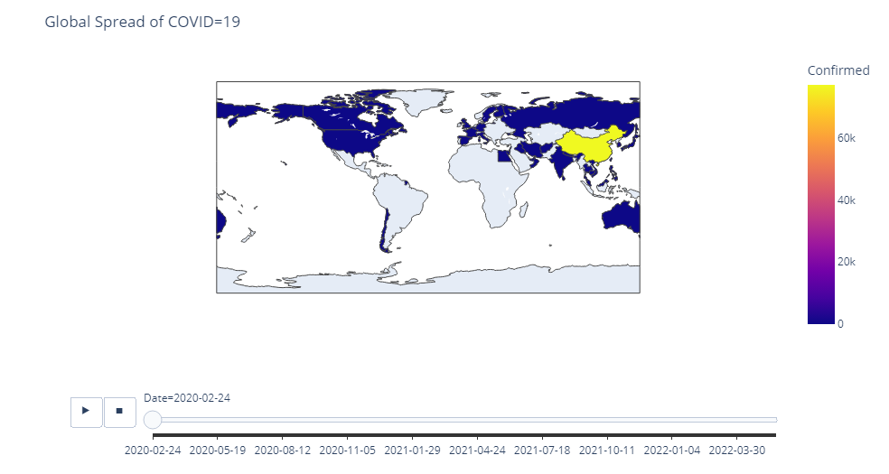

# Welcome to the Notebook

### Importing modules

### Task 1


```python
import pandas as pd
import numpy as np
import plotly.express as px
import matplotlib.pyplot as plt 
print('modules are imported')
```

    modules are imported
    

### Task 1.1: 
#### Loading the Dataset


```python
dataset_url = 'https://raw.githubusercontent.com/datasets/covid-19/master/data/countries-aggregated.csv'
df = pd.read_csv(dataset_url)
```

### Task 1.2:
#### let's check the dataframe 


```python
df.head()
```


<div>
<style scoped>
    .dataframe tbody tr th:only-of-type {
        vertical-align: middle;
    }

    .dataframe tbody tr th {
        vertical-align: top;
    }

    .dataframe thead th {
        text-align: right;
    }
</style>
<table border="1" class="dataframe">
  <thead>
    <tr style="text-align: right;">
      <th></th>
      <th>Date</th>
      <th>Country</th>
      <th>Confirmed</th>
      <th>Recovered</th>
      <th>Deaths</th>
    </tr>
  </thead>
  <tbody>
    <tr>
      <th>0</th>
      <td>2020-01-22</td>
      <td>Afghanistan</td>
      <td>0</td>
      <td>0</td>
      <td>0</td>
    </tr>
    <tr>
      <th>1</th>
      <td>2020-01-23</td>
      <td>Afghanistan</td>
      <td>0</td>
      <td>0</td>
      <td>0</td>
    </tr>
    <tr>
      <th>2</th>
      <td>2020-01-24</td>
      <td>Afghanistan</td>
      <td>0</td>
      <td>0</td>
      <td>0</td>
    </tr>
    <tr>
      <th>3</th>
      <td>2020-01-25</td>
      <td>Afghanistan</td>
      <td>0</td>
      <td>0</td>
      <td>0</td>
    </tr>
    <tr>
      <th>4</th>
      <td>2020-01-26</td>
      <td>Afghanistan</td>
      <td>0</td>
      <td>0</td>
      <td>0</td>
    </tr>
  </tbody>
</table>
</div>


```python
df.tail()
```


<div>
<style scoped>
    .dataframe tbody tr th:only-of-type {
        vertical-align: middle;
    }

    .dataframe tbody tr th {
        vertical-align: top;
    }

    .dataframe thead th {
        text-align: right;
    }
</style>
<table border="1" class="dataframe">
  <thead>
    <tr style="text-align: right;">
      <th></th>
      <th>Date</th>
      <th>Country</th>
      <th>Confirmed</th>
      <th>Recovered</th>
      <th>Deaths</th>
    </tr>
  </thead>
  <tbody>
    <tr>
      <th>161563</th>
      <td>2022-04-12</td>
      <td>Zimbabwe</td>
      <td>247094</td>
      <td>0</td>
      <td>5460</td>
    </tr>
    <tr>
      <th>161564</th>
      <td>2022-04-13</td>
      <td>Zimbabwe</td>
      <td>247160</td>
      <td>0</td>
      <td>5460</td>
    </tr>
    <tr>
      <th>161565</th>
      <td>2022-04-14</td>
      <td>Zimbabwe</td>
      <td>247208</td>
      <td>0</td>
      <td>5462</td>
    </tr>
    <tr>
      <th>161566</th>
      <td>2022-04-15</td>
      <td>Zimbabwe</td>
      <td>247237</td>
      <td>0</td>
      <td>5462</td>
    </tr>
    <tr>
      <th>161567</th>
      <td>2022-04-16</td>
      <td>Zimbabwe</td>
      <td>247237</td>
      <td>0</td>
      <td>5462</td>
    </tr>
  </tbody>
</table>
</div>


#### let's check the shape of the dataframe 


```python
df.shape
```


    (161568, 5)


### Task 2.1 :
#### let's do some preprocessing 


```python
df = df[df.Confirmed > 0]
```


```python
df.head()
```


<div>
<style scoped>
    .dataframe tbody tr th:only-of-type {
        vertical-align: middle;
    }

    .dataframe tbody tr th {
        vertical-align: top;
    }

    .dataframe thead th {
        text-align: right;
    }
</style>
<table border="1" class="dataframe">
  <thead>
    <tr style="text-align: right;">
      <th></th>
      <th>Date</th>
      <th>Country</th>
      <th>Confirmed</th>
      <th>Recovered</th>
      <th>Deaths</th>
    </tr>
  </thead>
  <tbody>
    <tr>
      <th>33</th>
      <td>2020-02-24</td>
      <td>Afghanistan</td>
      <td>5</td>
      <td>0</td>
      <td>0</td>
    </tr>
    <tr>
      <th>34</th>
      <td>2020-02-25</td>
      <td>Afghanistan</td>
      <td>5</td>
      <td>0</td>
      <td>0</td>
    </tr>
    <tr>
      <th>35</th>
      <td>2020-02-26</td>
      <td>Afghanistan</td>
      <td>5</td>
      <td>0</td>
      <td>0</td>
    </tr>
    <tr>
      <th>36</th>
      <td>2020-02-27</td>
      <td>Afghanistan</td>
      <td>5</td>
      <td>0</td>
      <td>0</td>
    </tr>
    <tr>
      <th>37</th>
      <td>2020-02-28</td>
      <td>Afghanistan</td>
      <td>5</td>
      <td>0</td>
      <td>0</td>
    </tr>
  </tbody>
</table>
</div>


#### let's see data related to a country for example Italy 


```python
df[df.Country == 'Italy']
```


<div>
<style scoped>
    .dataframe tbody tr th:only-of-type {
        vertical-align: middle;
    }

    .dataframe tbody tr th {
        vertical-align: top;
    }

    .dataframe thead th {
        text-align: right;
    }
</style>
<table border="1" class="dataframe">
  <thead>
    <tr style="text-align: right;">
      <th></th>
      <th>Date</th>
      <th>Country</th>
      <th>Confirmed</th>
      <th>Recovered</th>
      <th>Deaths</th>
    </tr>
  </thead>
  <tbody>
    <tr>
      <th>70185</th>
      <td>2020-01-31</td>
      <td>Italy</td>
      <td>2</td>
      <td>0</td>
      <td>0</td>
    </tr>
    <tr>
      <th>70186</th>
      <td>2020-02-01</td>
      <td>Italy</td>
      <td>2</td>
      <td>0</td>
      <td>0</td>
    </tr>
    <tr>
      <th>70187</th>
      <td>2020-02-02</td>
      <td>Italy</td>
      <td>2</td>
      <td>0</td>
      <td>0</td>
    </tr>
    <tr>
      <th>70188</th>
      <td>2020-02-03</td>
      <td>Italy</td>
      <td>2</td>
      <td>0</td>
      <td>0</td>
    </tr>
    <tr>
      <th>70189</th>
      <td>2020-02-04</td>
      <td>Italy</td>
      <td>2</td>
      <td>0</td>
      <td>0</td>
    </tr>
    <tr>
      <th>...</th>
      <td>...</td>
      <td>...</td>
      <td>...</td>
      <td>...</td>
      <td>...</td>
    </tr>
    <tr>
      <th>70987</th>
      <td>2022-04-12</td>
      <td>Italy</td>
      <td>15404809</td>
      <td>0</td>
      <td>161032</td>
    </tr>
    <tr>
      <th>70988</th>
      <td>2022-04-13</td>
      <td>Italy</td>
      <td>15467395</td>
      <td>0</td>
      <td>161187</td>
    </tr>
    <tr>
      <th>70989</th>
      <td>2022-04-14</td>
      <td>Italy</td>
      <td>15533012</td>
      <td>0</td>
      <td>161336</td>
    </tr>
    <tr>
      <th>70990</th>
      <td>2022-04-15</td>
      <td>Italy</td>
      <td>15595302</td>
      <td>0</td>
      <td>161469</td>
    </tr>
    <tr>
      <th>70991</th>
      <td>2022-04-16</td>
      <td>Italy</td>
      <td>15659835</td>
      <td>0</td>
      <td>161602</td>
    </tr>
  </tbody>
</table>
<p>807 rows × 5 columns</p>
</div>


#### let's see Global spread of Covid19


```python
fig = px.choropleth(df, locations = 'Country', locationmode='country names', color='Confirmed'
                   , animation_frame='Date')
fig.update_layout(title_text = 'Global Spread of COVID=19')
fig.show()
```



### Task 2.2 : Exercise 
#### Let's see Global deaths of Covid19


```python
fig = px.choropleth(df, locations = 'Country', locationmode='country names', color='Deaths'
                   , animation_frame='Date')
fig.update_layout(title_text = 'Global Deaths of COVID=19')
fig.show()
```

### Task 3.1:
#### Let's Visualize how intensive the Covid19 Transmission has been in each of the country
let's start with an example:


```python
df_china = df[(df.Country == 'China')&(df.Date < '2020-05-01')]
df_china.head()
```


<div>
<style scoped>
    .dataframe tbody tr th:only-of-type {
        vertical-align: middle;
    }

    .dataframe tbody tr th {
        vertical-align: top;
    }

    .dataframe thead th {
        text-align: right;
    }
</style>
<table border="1" class="dataframe">
  <thead>
    <tr style="text-align: right;">
      <th></th>
      <th>Date</th>
      <th>Country</th>
      <th>Confirmed</th>
      <th>Recovered</th>
      <th>Deaths</th>
    </tr>
  </thead>
  <tbody>
    <tr>
      <th>30192</th>
      <td>2020-01-22</td>
      <td>China</td>
      <td>548</td>
      <td>28</td>
      <td>17</td>
    </tr>
    <tr>
      <th>30193</th>
      <td>2020-01-23</td>
      <td>China</td>
      <td>643</td>
      <td>30</td>
      <td>18</td>
    </tr>
    <tr>
      <th>30194</th>
      <td>2020-01-24</td>
      <td>China</td>
      <td>920</td>
      <td>36</td>
      <td>26</td>
    </tr>
    <tr>
      <th>30195</th>
      <td>2020-01-25</td>
      <td>China</td>
      <td>1406</td>
      <td>39</td>
      <td>42</td>
    </tr>
    <tr>
      <th>30196</th>
      <td>2020-01-26</td>
      <td>China</td>
      <td>2075</td>
      <td>49</td>
      <td>56</td>
    </tr>
  </tbody>
</table>
</div>


let's select the columns that we need


```python
df_china = df_china[['Date','Confirmed']]
```


```python
df_china.head()
```


<div>
<style scoped>
    .dataframe tbody tr th:only-of-type {
        vertical-align: middle;
    }

    .dataframe tbody tr th {
        vertical-align: top;
    }

    .dataframe thead th {
        text-align: right;
    }
</style>
<table border="1" class="dataframe">
  <thead>
    <tr style="text-align: right;">
      <th></th>
      <th>Date</th>
      <th>Confirmed</th>
    </tr>
  </thead>
  <tbody>
    <tr>
      <th>30192</th>
      <td>2020-01-22</td>
      <td>548</td>
    </tr>
    <tr>
      <th>30193</th>
      <td>2020-01-23</td>
      <td>643</td>
    </tr>
    <tr>
      <th>30194</th>
      <td>2020-01-24</td>
      <td>920</td>
    </tr>
    <tr>
      <th>30195</th>
      <td>2020-01-25</td>
      <td>1406</td>
    </tr>
    <tr>
      <th>30196</th>
      <td>2020-01-26</td>
      <td>2075</td>
    </tr>
  </tbody>
</table>
</div>


calculating the first derivation of confrimed column


```python
df_china['Infection Rate'] = df_china['Confirmed'].diff()
```


```python
df_china.head()
```


<div>
<style scoped>
    .dataframe tbody tr th:only-of-type {
        vertical-align: middle;
    }

    .dataframe tbody tr th {
        vertical-align: top;
    }

    .dataframe thead th {
        text-align: right;
    }
</style>
<table border="1" class="dataframe">
  <thead>
    <tr style="text-align: right;">
      <th></th>
      <th>Date</th>
      <th>Confirmed</th>
      <th>Infection Rate</th>
    </tr>
  </thead>
  <tbody>
    <tr>
      <th>30192</th>
      <td>2020-01-22</td>
      <td>548</td>
      <td>NaN</td>
    </tr>
    <tr>
      <th>30193</th>
      <td>2020-01-23</td>
      <td>643</td>
      <td>95.0</td>
    </tr>
    <tr>
      <th>30194</th>
      <td>2020-01-24</td>
      <td>920</td>
      <td>277.0</td>
    </tr>
    <tr>
      <th>30195</th>
      <td>2020-01-25</td>
      <td>1406</td>
      <td>486.0</td>
    </tr>
    <tr>
      <th>30196</th>
      <td>2020-01-26</td>
      <td>2075</td>
      <td>669.0</td>
    </tr>
  </tbody>
</table>
</div>


```python
px.line(df_china, x = 'Date', y = ['Confirmed','Infection Rate'])
```


```python
df_china['Infection Rate'].max()
```


    15136.0


### Task 3.2:
#### Let's Calculate Maximum infection rate for all of the countries


```python
df.head()
```


<div>
<style scoped>
    .dataframe tbody tr th:only-of-type {
        vertical-align: middle;
    }

    .dataframe tbody tr th {
        vertical-align: top;
    }

    .dataframe thead th {
        text-align: right;
    }
</style>
<table border="1" class="dataframe">
  <thead>
    <tr style="text-align: right;">
      <th></th>
      <th>Date</th>
      <th>Country</th>
      <th>Confirmed</th>
      <th>Recovered</th>
      <th>Deaths</th>
    </tr>
  </thead>
  <tbody>
    <tr>
      <th>33</th>
      <td>2020-02-24</td>
      <td>Afghanistan</td>
      <td>5</td>
      <td>0</td>
      <td>0</td>
    </tr>
    <tr>
      <th>34</th>
      <td>2020-02-25</td>
      <td>Afghanistan</td>
      <td>5</td>
      <td>0</td>
      <td>0</td>
    </tr>
    <tr>
      <th>35</th>
      <td>2020-02-26</td>
      <td>Afghanistan</td>
      <td>5</td>
      <td>0</td>
      <td>0</td>
    </tr>
    <tr>
      <th>36</th>
      <td>2020-02-27</td>
      <td>Afghanistan</td>
      <td>5</td>
      <td>0</td>
      <td>0</td>
    </tr>
    <tr>
      <th>37</th>
      <td>2020-02-28</td>
      <td>Afghanistan</td>
      <td>5</td>
      <td>0</td>
      <td>0</td>
    </tr>
  </tbody>
</table>
</div>


```python
countries = list(df['Country'].unique())
max_infection_rates = []
for c in countries :
    MIR = df[df.Country == c].Confirmed.diff().max()
    max_infection_rates.append(MIR)

```

### Task 3.3:
#### let's create a new Dataframe 


```python
df_MIR = pd.DataFrame()
df_MIR['Country'] = countries
df_MIR['Max Infection Rates'] = max_infection_rates
df_MIR
```


<div>
<style scoped>
    .dataframe tbody tr th:only-of-type {
        vertical-align: middle;
    }

    .dataframe tbody tr th {
        vertical-align: top;
    }

    .dataframe thead th {
        text-align: right;
    }
</style>
<table border="1" class="dataframe">
  <thead>
    <tr style="text-align: right;">
      <th></th>
      <th>Country</th>
      <th>Max Infection Rates</th>
    </tr>
  </thead>
  <tbody>
    <tr>
      <th>0</th>
      <td>Afghanistan</td>
      <td>3243.0</td>
    </tr>
    <tr>
      <th>1</th>
      <td>Albania</td>
      <td>4789.0</td>
    </tr>
    <tr>
      <th>2</th>
      <td>Algeria</td>
      <td>2521.0</td>
    </tr>
    <tr>
      <th>3</th>
      <td>Andorra</td>
      <td>2313.0</td>
    </tr>
    <tr>
      <th>4</th>
      <td>Angola</td>
      <td>5035.0</td>
    </tr>
    <tr>
      <th>...</th>
      <td>...</td>
      <td>...</td>
    </tr>
    <tr>
      <th>193</th>
      <td>West Bank and Gaza</td>
      <td>30356.0</td>
    </tr>
    <tr>
      <th>194</th>
      <td>Winter Olympics 2022</td>
      <td>55.0</td>
    </tr>
    <tr>
      <th>195</th>
      <td>Yemen</td>
      <td>287.0</td>
    </tr>
    <tr>
      <th>196</th>
      <td>Zambia</td>
      <td>5555.0</td>
    </tr>
    <tr>
      <th>197</th>
      <td>Zimbabwe</td>
      <td>9185.0</td>
    </tr>
  </tbody>
</table>
<p>198 rows × 2 columns</p>
</div>


#### Let's plot the barchart : maximum infection rate of each country


```python
px.bar(df_MIR, x="Country", y='Max Infection Rates', color = 'Country', title = 'Global Max Infection Rate', log_y=True)
```

### Task 4: Let's See how National Lockdowns Impacts Covid19 transmission in Italy

### COVID19 pandemic lockdown in Italy 
On 9 March 2020, the government of Italy under Prime Minister Giuseppe Conte imposed a national quarantine, restricting the movement of the population except for necessity, work, and health circumstances, in response to the growing pandemic of COVID-19 in the country. <a href="https://en.wikipedia.org/wiki/COVID-19_pandemic_lockdown_in_Italy#:~:text=On%209%20March%202020%2C%20the,COVID%2D19%20in%20the%20country.">source</a>


```python
italy_lockdown_start_date = '2020-03-09'
italy_lockdown_a_month_later = '2020-04-09'
```


```python
df.head()
```


<div>
<style scoped>
    .dataframe tbody tr th:only-of-type {
        vertical-align: middle;
    }

    .dataframe tbody tr th {
        vertical-align: top;
    }

    .dataframe thead th {
        text-align: right;
    }
</style>
<table border="1" class="dataframe">
  <thead>
    <tr style="text-align: right;">
      <th></th>
      <th>Date</th>
      <th>Country</th>
      <th>Confirmed</th>
      <th>Recovered</th>
      <th>Deaths</th>
    </tr>
  </thead>
  <tbody>
    <tr>
      <th>33</th>
      <td>2020-02-24</td>
      <td>Afghanistan</td>
      <td>5</td>
      <td>0</td>
      <td>0</td>
    </tr>
    <tr>
      <th>34</th>
      <td>2020-02-25</td>
      <td>Afghanistan</td>
      <td>5</td>
      <td>0</td>
      <td>0</td>
    </tr>
    <tr>
      <th>35</th>
      <td>2020-02-26</td>
      <td>Afghanistan</td>
      <td>5</td>
      <td>0</td>
      <td>0</td>
    </tr>
    <tr>
      <th>36</th>
      <td>2020-02-27</td>
      <td>Afghanistan</td>
      <td>5</td>
      <td>0</td>
      <td>0</td>
    </tr>
    <tr>
      <th>37</th>
      <td>2020-02-28</td>
      <td>Afghanistan</td>
      <td>5</td>
      <td>0</td>
      <td>0</td>
    </tr>
  </tbody>
</table>
</div>


let's get data related to italy


```python
df_italy = df[(df.Country == 'Italy')&(df.Date < '2020-06-01')]
```

lets check the dataframe


```python
df_italy.head()
```


<div>
<style scoped>
    .dataframe tbody tr th:only-of-type {
        vertical-align: middle;
    }

    .dataframe tbody tr th {
        vertical-align: top;
    }

    .dataframe thead th {
        text-align: right;
    }
</style>
<table border="1" class="dataframe">
  <thead>
    <tr style="text-align: right;">
      <th></th>
      <th>Date</th>
      <th>Country</th>
      <th>Confirmed</th>
      <th>Recovered</th>
      <th>Deaths</th>
    </tr>
  </thead>
  <tbody>
    <tr>
      <th>70185</th>
      <td>2020-01-31</td>
      <td>Italy</td>
      <td>2</td>
      <td>0</td>
      <td>0</td>
    </tr>
    <tr>
      <th>70186</th>
      <td>2020-02-01</td>
      <td>Italy</td>
      <td>2</td>
      <td>0</td>
      <td>0</td>
    </tr>
    <tr>
      <th>70187</th>
      <td>2020-02-02</td>
      <td>Italy</td>
      <td>2</td>
      <td>0</td>
      <td>0</td>
    </tr>
    <tr>
      <th>70188</th>
      <td>2020-02-03</td>
      <td>Italy</td>
      <td>2</td>
      <td>0</td>
      <td>0</td>
    </tr>
    <tr>
      <th>70189</th>
      <td>2020-02-04</td>
      <td>Italy</td>
      <td>2</td>
      <td>0</td>
      <td>0</td>
    </tr>
  </tbody>
</table>
</div>


let's calculate the infection rate in Italy


```python
df_italy['Infection Rate'] = df_italy.Confirmed.diff()
df_italy.head()
```

    C:\Users\dimas\AppData\Local\Temp\ipykernel_30304\1901679585.py:1: SettingWithCopyWarning: 
    A value is trying to be set on a copy of a slice from a DataFrame.
    Try using .loc[row_indexer,col_indexer] = value instead
    
    See the caveats in the documentation: https://pandas.pydata.org/pandas-docs/stable/user_guide/indexing.html#returning-a-view-versus-a-copy
      df_italy['Infection Rate'] = df_italy.Confirmed.diff()
    


<div>
<style scoped>
    .dataframe tbody tr th:only-of-type {
        vertical-align: middle;
    }

    .dataframe tbody tr th {
        vertical-align: top;
    }

    .dataframe thead th {
        text-align: right;
    }
</style>
<table border="1" class="dataframe">
  <thead>
    <tr style="text-align: right;">
      <th></th>
      <th>Date</th>
      <th>Country</th>
      <th>Confirmed</th>
      <th>Recovered</th>
      <th>Deaths</th>
      <th>Infection Rate</th>
    </tr>
  </thead>
  <tbody>
    <tr>
      <th>70185</th>
      <td>2020-01-31</td>
      <td>Italy</td>
      <td>2</td>
      <td>0</td>
      <td>0</td>
      <td>NaN</td>
    </tr>
    <tr>
      <th>70186</th>
      <td>2020-02-01</td>
      <td>Italy</td>
      <td>2</td>
      <td>0</td>
      <td>0</td>
      <td>0.0</td>
    </tr>
    <tr>
      <th>70187</th>
      <td>2020-02-02</td>
      <td>Italy</td>
      <td>2</td>
      <td>0</td>
      <td>0</td>
      <td>0.0</td>
    </tr>
    <tr>
      <th>70188</th>
      <td>2020-02-03</td>
      <td>Italy</td>
      <td>2</td>
      <td>0</td>
      <td>0</td>
      <td>0.0</td>
    </tr>
    <tr>
      <th>70189</th>
      <td>2020-02-04</td>
      <td>Italy</td>
      <td>2</td>
      <td>0</td>
      <td>0</td>
      <td>0.0</td>
    </tr>
  </tbody>
</table>
</div>


ok! now let's do the visualization


```python
fig = px.line(df_italy, x='Date', y='Infection Rate', title='Before and After Lockdown in Italy')
fig.add_shape(
    dict(
    type='line',
    x0 = italy_lockdown_start_date,
    y0 = 0,
    x1 = italy_lockdown_start_date,
    y1 = df_italy['Infection Rate'].max(),
    line = dict(color='red', width=2)
        
    )
)

fig.add_annotation(
    dict(
    x = italy_lockdown_start_date,
    y = df_italy['Infection Rate'].max(),
    text = 'Start of the Lockdown'
    )

)


fig.add_shape(
    dict(
    type='line',
    x0 = italy_lockdown_a_month_later,
    y0 = 0,
    x1 = italy_lockdown_a_month_later,
    y1 = df_italy['Infection Rate'].max(),
    line = dict(color='yellow', width=2)
        
    )
)

fig.add_annotation(
    dict(
    x = italy_lockdown_a_month_later,
    y = 0,
    text = 'Month of the Lockdown'
    )

)
```

### Task 5: Let's See how National Lockdowns Impacts Covid19 active cases in Italy


```python
df_italy.head()
```


<div>
<style scoped>
    .dataframe tbody tr th:only-of-type {
        vertical-align: middle;
    }

    .dataframe tbody tr th {
        vertical-align: top;
    }

    .dataframe thead th {
        text-align: right;
    }
</style>
<table border="1" class="dataframe">
  <thead>
    <tr style="text-align: right;">
      <th></th>
      <th>Date</th>
      <th>Country</th>
      <th>Confirmed</th>
      <th>Recovered</th>
      <th>Deaths</th>
      <th>Infection Rate</th>
    </tr>
  </thead>
  <tbody>
    <tr>
      <th>70185</th>
      <td>2020-01-31</td>
      <td>Italy</td>
      <td>2</td>
      <td>0</td>
      <td>0</td>
      <td>NaN</td>
    </tr>
    <tr>
      <th>70186</th>
      <td>2020-02-01</td>
      <td>Italy</td>
      <td>2</td>
      <td>0</td>
      <td>0</td>
      <td>0.0</td>
    </tr>
    <tr>
      <th>70187</th>
      <td>2020-02-02</td>
      <td>Italy</td>
      <td>2</td>
      <td>0</td>
      <td>0</td>
      <td>0.0</td>
    </tr>
    <tr>
      <th>70188</th>
      <td>2020-02-03</td>
      <td>Italy</td>
      <td>2</td>
      <td>0</td>
      <td>0</td>
      <td>0.0</td>
    </tr>
    <tr>
      <th>70189</th>
      <td>2020-02-04</td>
      <td>Italy</td>
      <td>2</td>
      <td>0</td>
      <td>0</td>
      <td>0.0</td>
    </tr>
  </tbody>
</table>
</div>


let's calculate number of active cases day by day 


```python
df_italy['Deaths Rate'] = df_italy.Deaths.diff()
```

    C:\Users\dimas\AppData\Local\Temp\ipykernel_30304\3823060142.py:1: SettingWithCopyWarning: 
    A value is trying to be set on a copy of a slice from a DataFrame.
    Try using .loc[row_indexer,col_indexer] = value instead
    
    See the caveats in the documentation: https://pandas.pydata.org/pandas-docs/stable/user_guide/indexing.html#returning-a-view-versus-a-copy
      df_italy['Deaths Rate'] = df_italy.Deaths.diff()
    

let's check the dataframe again


```python
df_italy.head()
```


<div>
<style scoped>
    .dataframe tbody tr th:only-of-type {
        vertical-align: middle;
    }

    .dataframe tbody tr th {
        vertical-align: top;
    }

    .dataframe thead th {
        text-align: right;
    }
</style>
<table border="1" class="dataframe">
  <thead>
    <tr style="text-align: right;">
      <th></th>
      <th>Date</th>
      <th>Country</th>
      <th>Confirmed</th>
      <th>Recovered</th>
      <th>Deaths</th>
      <th>Infection Rate</th>
      <th>Deaths Rate</th>
    </tr>
  </thead>
  <tbody>
    <tr>
      <th>70185</th>
      <td>2020-01-31</td>
      <td>Italy</td>
      <td>2</td>
      <td>0</td>
      <td>0</td>
      <td>NaN</td>
      <td>NaN</td>
    </tr>
    <tr>
      <th>70186</th>
      <td>2020-02-01</td>
      <td>Italy</td>
      <td>2</td>
      <td>0</td>
      <td>0</td>
      <td>0.0</td>
      <td>0.0</td>
    </tr>
    <tr>
      <th>70187</th>
      <td>2020-02-02</td>
      <td>Italy</td>
      <td>2</td>
      <td>0</td>
      <td>0</td>
      <td>0.0</td>
      <td>0.0</td>
    </tr>
    <tr>
      <th>70188</th>
      <td>2020-02-03</td>
      <td>Italy</td>
      <td>2</td>
      <td>0</td>
      <td>0</td>
      <td>0.0</td>
      <td>0.0</td>
    </tr>
    <tr>
      <th>70189</th>
      <td>2020-02-04</td>
      <td>Italy</td>
      <td>2</td>
      <td>0</td>
      <td>0</td>
      <td>0.0</td>
      <td>0.0</td>
    </tr>
  </tbody>
</table>
</div>


now let's plot a line chart to compare COVID19 national lockdowns impacts on spread of the virus and number of active cases


```python
fig = px.line(df_italy, x='Date', y=['Infection Rate', 'Deaths Rate'])
fig.show()
```


```python
df_italy['Infection Rate'] = df_italy['Infection Rate']/df_italy['Infection Rate'].max()
df_italy['Deaths Rate'] =  df_italy['Deaths Rate']/df_italy['Deaths Rate'].max()
```

    C:\Users\dimas\AppData\Local\Temp\ipykernel_30304\3228726369.py:1: SettingWithCopyWarning: 
    A value is trying to be set on a copy of a slice from a DataFrame.
    Try using .loc[row_indexer,col_indexer] = value instead
    
    See the caveats in the documentation: https://pandas.pydata.org/pandas-docs/stable/user_guide/indexing.html#returning-a-view-versus-a-copy
      df_italy['Infection Rate'] = df_italy['Infection Rate']/df_italy['Infection Rate'].max()
    C:\Users\dimas\AppData\Local\Temp\ipykernel_30304\3228726369.py:2: SettingWithCopyWarning: 
    A value is trying to be set on a copy of a slice from a DataFrame.
    Try using .loc[row_indexer,col_indexer] = value instead
    
    See the caveats in the documentation: https://pandas.pydata.org/pandas-docs/stable/user_guide/indexing.html#returning-a-view-versus-a-copy
      df_italy['Deaths Rate'] =  df_italy['Deaths Rate']/df_italy['Deaths Rate'].max()
    


```python
fig = px.line(df_italy, x='Date', y=['Infection Rate','Deaths Rate'])


fig.add_shape(
    dict(
    type='line',
    x0 = italy_lockdown_start_date,
    y0 = 0,
    x1 = italy_lockdown_start_date,
    y1 = df_italy['Infection Rate'].max(),
    line = dict(color='red', width=2)
        
    )
)

fig.add_annotation(
    dict(
    x = italy_lockdown_start_date,
    y = df_italy['Infection Rate'].max(),
    text = 'Start of the Lockdown'
    )

)


fig.add_shape(
    dict(
    type='line',
    x0 = italy_lockdown_a_month_later,
    y0 = 0,
    x1 = italy_lockdown_a_month_later,
    y1 = df_italy['Infection Rate'].max(),
    line = dict(color='yellow', width=2)
        
    )
)

fig.add_annotation(
    dict(
    x = italy_lockdown_a_month_later,
    y = 0,
    text = 'Month of the Lockdown'
    )

)

fig.show()
```


```python

```
